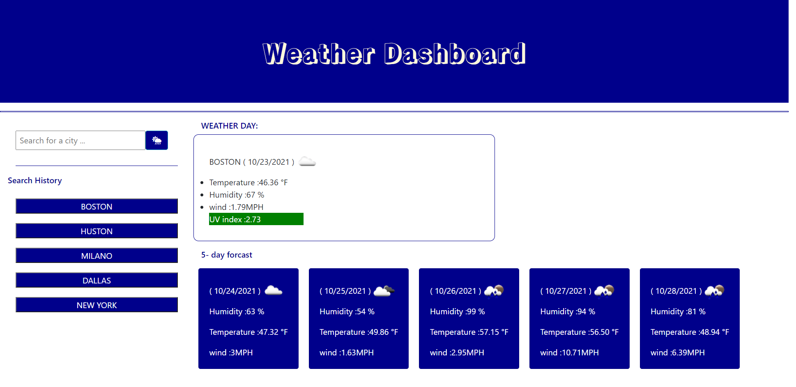

# Weather-Dashboard

Creation of a repository in GitHub:

  * Name of repository: Weather Dashboard
  * Using GitBash to create Directories and files.

# Starting to Apply the Acceptance Criteria.

 * The Weather Dashboard interface presented with a search input that allows the Traveler (as User)  to see the current and future conditions for 
   the searched city;
 * Every Searched city added automatically to the Search History;
 * The current weather conditions for a city is presented with the city name, the date, an icon representation of weather conditions, the temperature, the humidity, the wind speed, and the UV index.
 * UV index is presented with a color that indicates whether the conditions are favorable(green), moderate(yellow), or severe(red);
 * the Weather interface presented also with a 5-day forecast that displays the date, an icon representation of weather conditions, the temperature, the wind speed, and the humidity;
 * If the Traveler clicks on a searched city in the search history then he will be presented with current and future conditions for that city.

# Extra developing code :

* If the Traveler entred an unfouned city he will redirect to a 404 page ;

# GitBash & GitHub:

* Commit with msg every modification in code.
* Pushing to the repository in GitHub. 

# Application's Screenshots :

* The Weather Dashboard interface :

* Add City :

* Display weather from search History:

* Invalid city page :

# Links :

* The URL of the deployed application: https://meryem-ad.github.io/Weather-Dashboard/Webpages/index.html

* The URL of the GitHub repository: https://github.com/MERYEM-AD/Weather-Dashboard
